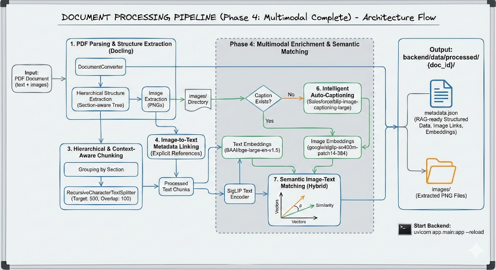

# Multimodal Embedding Pipeline (Phase 4)

This project implements an advanced **Multimodal embedding processing system. Unlike traditional text-only RAG, this pipeline processes, understands, and interlinks both text and images from complex documents (PDFs).

## 1. System Architecture & Flow

The pipeline operates as an automated background workflow triggered immediately after document upload.

### The Workflow

1. **Ingestion (`POST /upload`)**: User uploads a PDF.
2. **Structural Parsing (Phase 3)**: The system extracts text hierarchical, sections, and images using `Docling`.
3. **Multimodal Trigger**: Once parsing is complete, the **Multimodal Pipeline** (`app.services.multimodal`) is automatically triggered for the document.
4. **Embedding Generation**:
    * Text chunks are vectorized.
    * Images are vectorized.
    * Captions are generated/verified and vectorized.
5. **Semantic Linking**: The system runs a "Hybrid Matching" algorithm to find the exact text paragraphs that talk about specific images, linking them bi-directionally.

## 2. AI Models & Rationale

We selected a specific suite of State-of-the-art (SOTA) models to ensure high performance and efficiency.

### A. Text Embedding: `BAAI/bge-large-en-v1.5`

* **Purpose**: Vectorizing text chunks for retrieval.
* **Why**: BGE (BAAI General Embedding) is currently the leaderboard leader for massive text retrieval tasks. It handles long contexts better than classic BERT models.
* **Dimension**: 1024

### B. Image Embedding: `google/siglip-so400m-patch14-384`

* **Purpose**: Vectorizing images and matching them to text.
* **Why**: **SigLIP (Sigmoid Loss for Language Image Pre-training)** is a modern upgrade to CLIP.
  * *Better Accuracy*: It understands fine-grained visual details better than standard CLIP.
  * *Efficiency*: It uses a sigmoid loss function which scales better during pre-training, resulting in a more robust model for the same size.
* **Dimension**: 1152

### C. Image Captioning: `Salesforce/blip-image-captioning-large`

* **Purpose**: Generating descriptive text for images that lack accessible metadata.
* **Why**: **BLIP (Bootstrapping Language-Image Pre-training)** is excellent at generating "human-like" descriptions.
  * We chose the `Large` variant (~1.8GB) as a balance between quality and speed.
  * *Fallback Logic*: We only run this model if the PDF's internal caption is missing, too short (e.g., "Figure 1"), or generic.

## 3. The Multimodal Engine (`multimodal.py`)

The core logic resides in `backend/app/services/multimodal.py`. Here is how it processes a document step-by-step:

### Step 1: Image Processing & Captioning

The `run()` function iterates through every extracted image:

1. **Validation**: Checks if the existing PDF caption is valid (length > 3 words, not generic).
2. **Generation**: If invalid, it loads the BLIP model (lazy-loading) and generates a new caption (e.g., "a diagram showing the layers of the epidermis").
3. **Embedding**: It runs the image through **SigLIP** to get a `1152d` vector (`embedding_siglip_image`).
4. **Caption Embedding**: It also embeds the final caption using SigLIP's Text Encoder (`embedding_siglip_caption`). This is crucial for matching.

### Step 2: Text Chunk Processing

It iterates through all text chunks:

1. **Contextualization**: It prepends the Section Title to the text content (e.g., "Introduction: The importance of...") to improve retrieval context.
2. **BGE Embedding**: Generates the primary search vector (`embedding_bge`) (1024d).
3. **SigLIP Text Embedding**: Generates a secondary vector (`embedding_siglip`) used *exclusively* for matching against images.

### Step 3: Semantic Image-Text Matching (The "Linker")

This is the most critical logic. We want to answer: *"Which paragraph discusses this image?"*

#### The Algorithm

For each image, we look for the best matching text chunk:

1. **Candidate Filtering (Metadata-First)**:
    * To save time and avoid false positives, we only look at chunks on the **Same Page** or in the **Same Section** as the image.
    * *Fallback*: If none are found, we expand the search window to +/- 1 page.

2. **Hybrid Verification**: we compute a similarity score:

    ```python
    Score = (0.7 * Image_Vector • Text_Vector) + (0.3 * Caption_Vector • Text_Vector)
    ```

    * **Logic**: We trust the raw image content (SigLIP) the most (70%), but we boost the score (30%) if the text also semantically matches the caption we generated.

3. **Thresholding**:
    * If the `Score > 0.25`: We confirm the match.
    * **Action**: We save the `linked_chunk_id` in the image metadata and add the `image_id` to the text chunk's `linked_image_ids` list.

## 4. Outputs

For every processed document in `backend/data/processed/{doc_id}/`:

1. **`metadata.json`**:
    * The "Machine Readable" Source of Truth.
    * Contains the full Tree Structure, all Text Chunks, and all Embeddings (Dimensions: 1024 & 1152).
2. **`multimodal_summary.json`**:
    * A "Human Readable" report for verification.
    * Shows: Image Caption -> Matched Text Snippet -> Match Score.
    * Example:

        ```json
        {
          "image_id": "...",
          "caption": "illustration of a tooth cross-section",
          "matched_text": "The inner pulp of the tooth contains...",
          "score": 0.85
        }
        ```


